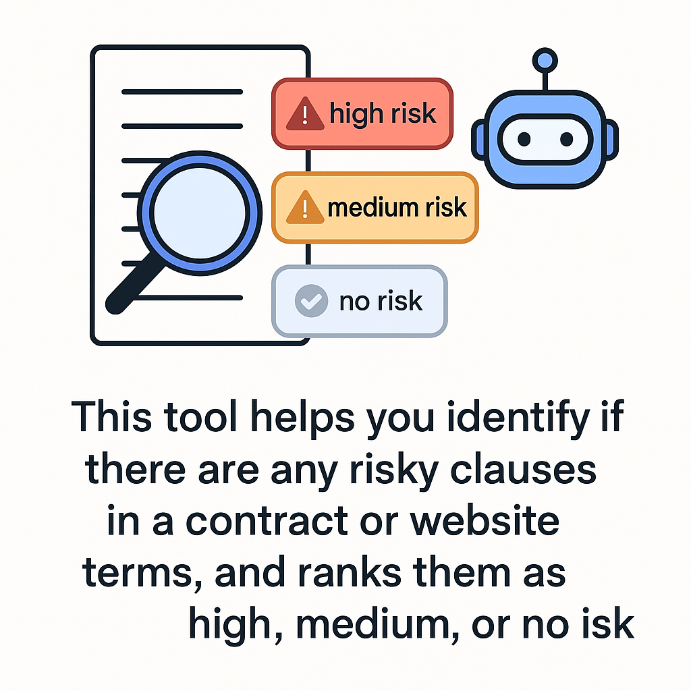
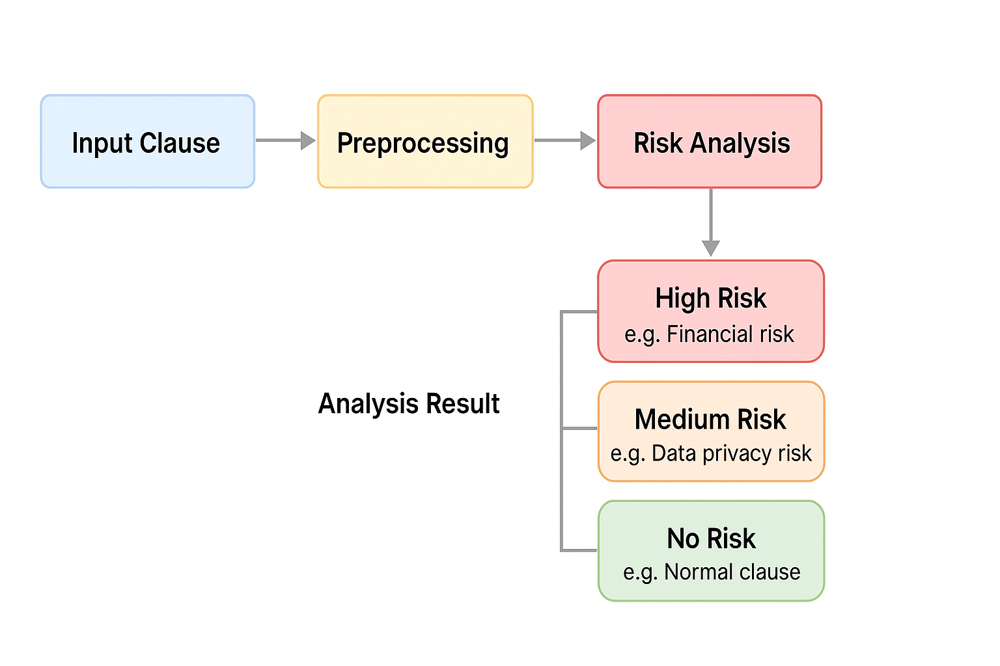

# 🧠 AI 合約條款風險摘要工具（README）

這個工具可以幫你快速看懂同意書或服務條款裡，有沒有潛在的風險條款，像是會不會被強制授權、個資被濫用等等。它會幫你分析每一段文字風險，回傳結構化的結果（JSON），也可以串接在網站或瀏覽器工具裡。



---

## 📌 工具用途

- 幫助使用者快速理解條款中的風險
- 自動分析內容，回傳「高」、「中」、「無風險」分類
- 適合整合在 Chrome 外掛、網站或其他應用程式中

---

## 🧩 怎麼判斷風險？

我們把條款分成 3 類：

- **高風險**：明顯對使用者不公平、可能違法
- **中風險**：增加使用者負擔或限制，但不至於違法
- **無風險／正常條款**：合理、常見、沒有明顯風險

### 分析時我們會問 GPT 這樣的問題：
```text
請判斷以下條款是否存在使用者風險，若有請標示風險等級（高、中），說明理由與風險類型；若無風險，請說明為何屬於一般正常條款。
條款：「......」
```

---

## ⚙️ 條款分析流程（從上傳到回報）

```text
使用者上傳條款檔案 (.txt/.pdf/.html)
     ↓
先整理文字（清掉雜訊、格式）
     ↓
自動判斷語言（中文或英文）
     ↓
將條款切成一句一句的句子
     ↓
每一句都丟給 GPT 判斷風險
     ↓
整合所有結果，生成報告（JSON 或 HTML 顯示）
```



---

## 🔍 工具檔案簡介

| 檔案／模組         | 功能說明                              |
|------------------|-------------------------------------|
| `risk_test.py`   | 單一句子的風險測試（可直接執行）         |
| `data/*.md`      | 收集的範例條款資料（用來訓練或比對）        |
| `summarizer.py`  | 批次處理多條條款並整合風險結果             |
| `chrome_plugin/` | Chrome 外掛，用來即時提示條款風險         |

---

## 🤖 為什麼不用 ChatGPT 對話直接問？

| 比較項目       | 我們的工具（結構化）        | ChatGPT 對話方式       |
|--------------|-------------------------|----------------------|
| 回傳格式       | ✅ JSON 可讀取               | ❌ 純文字難整合         |
| 穩定性         | ✅ 穩定，流程固定             | ⚠️ 回答品質不一定        |
| 自動處理能力     | ✅ 可整合到系統或網頁           | ❌ 僅限人工對話         |
| 可優化空間      | ✅ 可收集使用者回饋調整判斷邏輯     | ❌ 無法學習、每次重來     |

---

## 🚀 工具開發進度

### 第一階段（已完成）
- 建好基本的風險分類邏輯和 prompt 模板
- 完成單句測試腳本 `risk_test.py`

### 第二階段（正在進行）
- 開發 Chrome 擴充功能（可即時高亮條款）
- 加入使用者標記與回饋機制

### 第三階段（接下來會做）
- 將功能做成 API 提供外部系統使用
- 累積資料來訓練風險判別模型

---

## 📂 條款資料說明與擴充計畫

- 條款範例來自公開資料，經人工分類風險
- 未來會擴充至 1000 條以上，並分類風險類型與理由
- 使用者上傳的新條款會丟給 GPT 分析，並持續優化風險標準

---

如需擴充功能（批次處理、多語系、API 架設等），請參考 `summarizer.py` 或聯絡我們的開發團隊。
